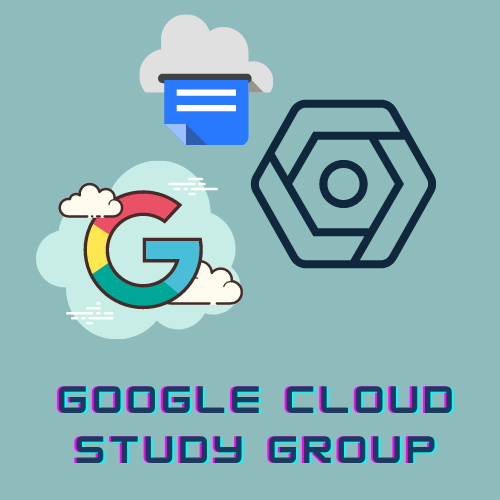

  &nbsp;&nbsp;&nbsp; 

## Welcome to GCP Associate Cloud Engineer Github Repo!  

Below you will find the schedule, content, and resources for the Women Who Code GCP Certification Study Group.

This study group will provide support participants need to reach their GCP certification goals. Any and all cloud interested engineers are welcome! Whether you're new to cloud computing or an experienced DevOps engineer, this study group will provide a ton of value and resources you need to reach your goals.

Collectively we have 4 main goals... To provide Accountability, Support, Resources, and Real World Experiences.

We will hold each other accountable for getting our certifications by holding and attending regular meetings to check in.
We will offer support to encourage everyone interested in embracing this journey by sharing and collaborating.
We will recommend resources to increase our chances of success.
We will share real world experiences to drive home our learnings and enable us to level up in our careers.

Note this group is **not going to teach the exam material**. There are a TON of resources and experts who's sole focus and expertise lies in helping people pass the exams. We will encourage participants to use these resources to learn the material and we provide the space and support to set you up for success!

We look forward to embarking on this fun journey with you! Checkout the graphics and schedule below for details about our upcoming (AND FIRST :celebrate:) phase.

## Schedule

#### Associate Cloud Engineer (ACE) Certification

- [ ] 6/19: Group Intro + Resource Review

- [ ] 6/26: 

- [ ] 7/10: 

- [ ] 7/17: 

- [ ] 7/24: 

- [ ] 7/31: 

